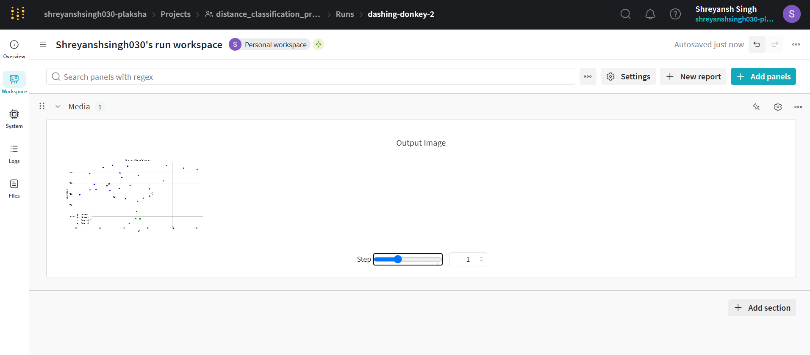
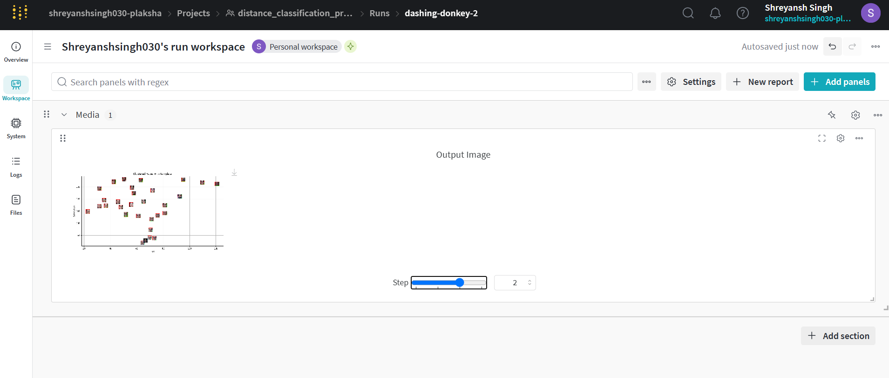

#### 1. What are the common distance metrics used in distance-based classification algorithms? 
Euclidean, Manhattan, Mahalanobis, Chebyshev and Cosine similarity are common distance metrics.
#### 2. What are some real-world applications of distance-based classification algorithms? 
image recognition, recommendation systems, fraud detection, medical diagnosis etc.
#### 3. Explain various distance metrics. 
Euclidean distance is the straight-line distance between two points
Manhattan is the sum of the absolute differences of their coordinates.
Malhanoblis is a distance measure that accounts for correlations between variables and scales the differences according to the data’s covariance structure.
Chebyshev is the maximum absolute difference along any coordinate dimension.
Cosine quantifies how similar two vectors are based on the angle between them.
#### 4. What is the role of cross validation in model performance? 
Cross validation helps to assess model performance by partitioning data into training and test sets multiple times to reduce overfitting and estimate generalization.
#### 5. Explain variance and bias in terms of KNN? 
In KNN, low k leads to low bias and high variance (overfitting), while high k increases bias and reduces variance (underfitting).